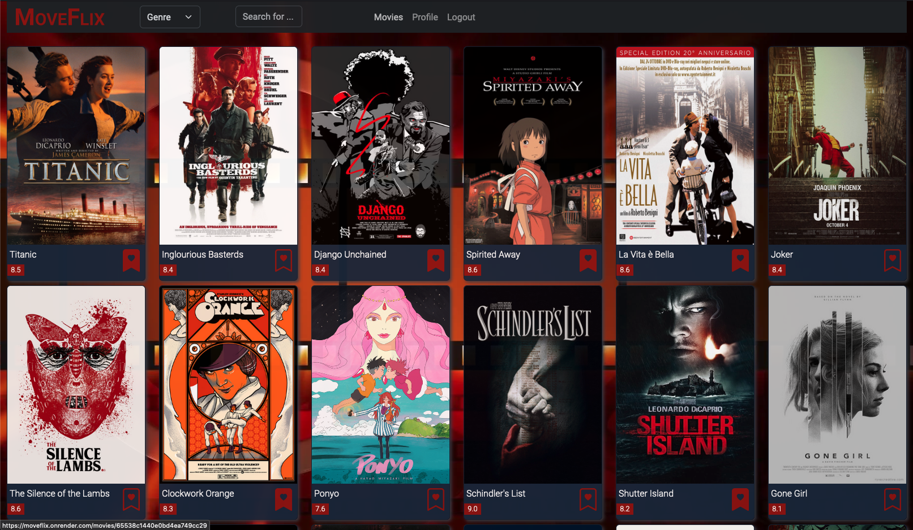
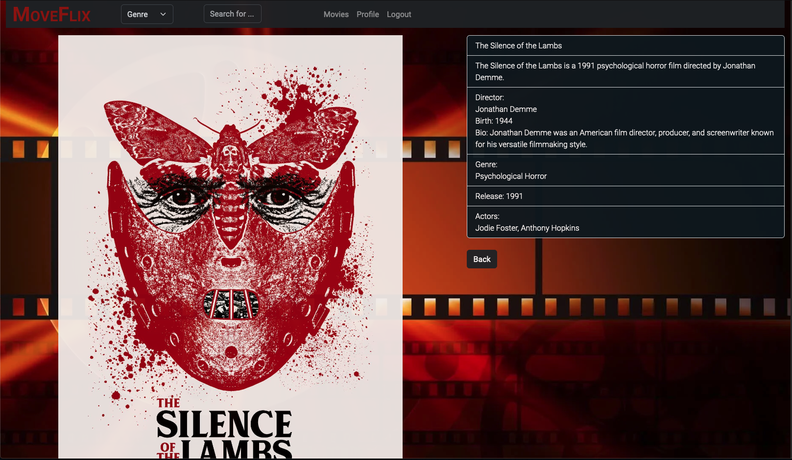
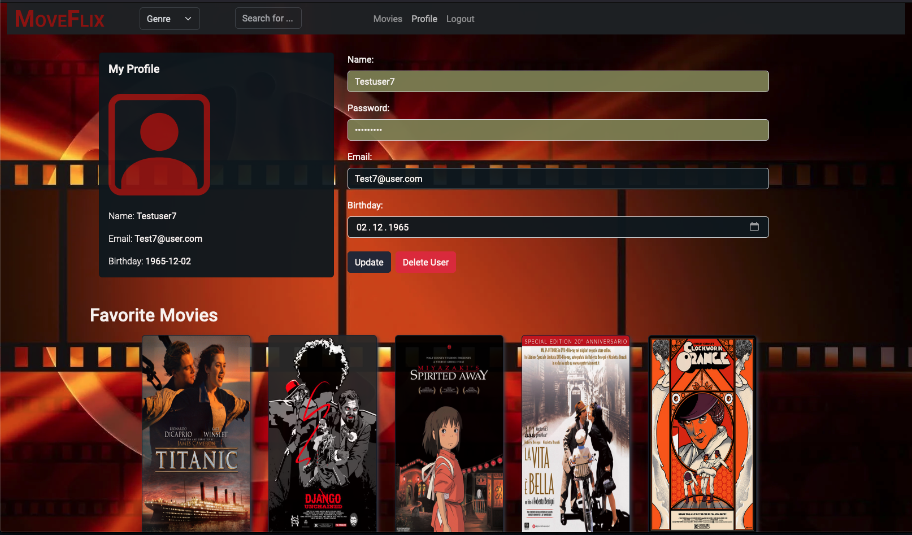
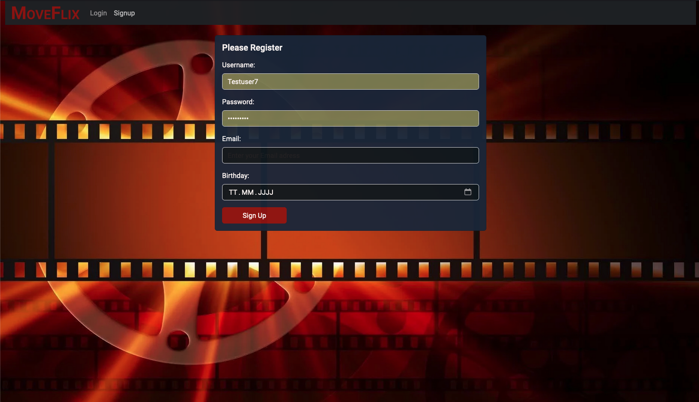

# moveFlix-client

## Table of Contents

1. [Introduction](#Introduction)
2. [Objective](#Objective)
3. [User Stories](#User-Stories)
4. [Features & Requirements](#Features-&-Requirements)
5. [Technical Requirements](#Technical-Requirements)
6. [Live Version](#Live-Version)
7. [Screenshots of the moveFlix App](#Screenshots)
8. [Running the Project](#Running-the-Project)
9. [References](#References)
10. [Acknowledgements](Acknowldedgements)

## Introduction

Welcome to the client-side of my movie app "moveFlix". This application is built with React and Parcel as the build tool, which was installed with the node package manager npm. PropTypes is used to document the intended types of properties passed to components. The backend myFlix API is built with Node.js, Express, and MongoDB. This client-side application is the third achievement in my Full-Stack Web-Development Course with CareerFoundry. The second achievement was the Movie API that I built. The aim of these achievements was to learn how to use the MERN tech stack to build a complete app. It gives movie lovers the possibility to view a list of movies with detailed information. Users can sign-up, login, and add their favorite movies to their favorite movie list.

## Objective

The objective of this project was to build the client-side for an application called myFlix based on its existing server-side code (REST API and database). The client-side of the myFlix app includes several interface views that handle data through the previously defined REST API endpoints.

## User Stories

-   As a user, I want to be able to access information about movies so that I can learn more about movies I’ve watched or am interested in.
-   As a user, I want to be able to create a profile so I can save data about my favorite movies.

## Features & Requirements

The application includes the following features:

-   Main view: Returns all movies to the user with a search feature, ability to select a movie for more details, log out, and navigate to Profile view.
-   Single Movie view: Returns data about a single movie to the user and allows users to add a movie to their list of favorites.
-   Login view: Allows users to log in with a username and password.
-   Signup view: Allows new users to register.
-   Profile view: Displays user registration details, allows users to update their info, displays favorite movies, allows users to remove a movie from their list of favorites, and allows existing users to deregister.

## Technical Requirements

-   The application is a single-page application (SPA).
-   The application uses state routing to navigate between views and share URLs.
-   The application gives users the option to filter movies using a “search” feature.
-   The application uses Parcel as its build tool.
-   The application is written using the React library and in ES2015+.
-   The application uses Bootstrap as a UI library for styling and responsiveness.
-   The application contains function components.
-   The application is hosted online.

## Live Version

The live version of the moveFlix app can be accessed [here](https://moveflix.onrender.com).

## Screenshots

## Running the Project

To run the project using Parcel, use the following command: `parcel src/index.html`

## References

The moveFlix client-side application is built using the following technologies and tools:

-   [React](https://reactjs.org/): A JavaScript library for building user interfaces.
-   [Parcel](https://parceljs.org/): A web application bundler, differentiated by its developer experience, offering things like out-of-the-box hot module replacement for all file types.
-   [npm](https://www.npmjs.com/): The package manager for JavaScript and the world’s largest software registry.
-   [PropTypes](https://www.npmjs.com/package/prop-types): Used to document the intended types of properties passed to components.
-   [Node.js](https://nodejs.org/en/): A JavaScript runtime built on Chrome's V8 JavaScript engine.
-   [Express](https://expressjs.com/): A minimal and flexible Node.js web application framework that provides a robust set of features for web and mobile applications.
-   [MongoDB](https://www.mongodb.com/): A source-available cross-platform document-oriented database program. Classified as a NoSQL database program, MongoDB uses JSON-like documents with optional schemas.
-   [Bootstrap](https://getbootstrap.com/): The world’s most popular front-end open source toolkit, featuring Sass variables and mixins, responsive grid system, extensive prebuilt components, and powerful JavaScript plugins.
-   [Render](https://render.com/): A unified platform to build and run all your apps and websites with free SSL, a global CDN, private networks and auto deploys from Git.

## Acknowledgements

This project was completed as part of the Full-Stack Web Development program at [CareerFoundry](https://www.careerfoundry.com/). Special thanks to my tutor and mentor for their guidance and support throughout the course.
